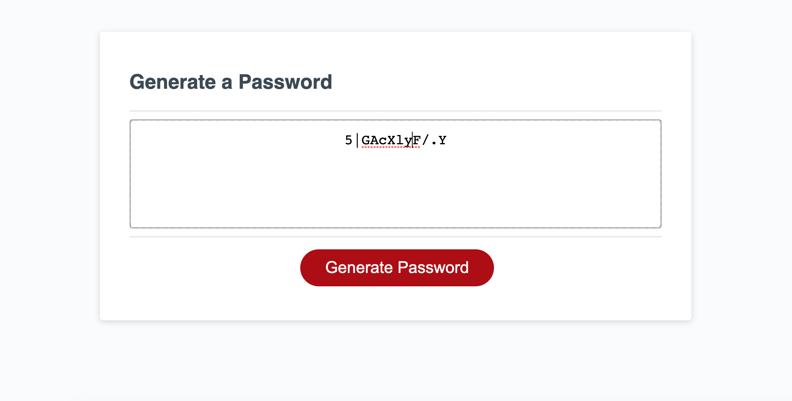

# Random-Password-Generator
GOAL: Random Password Generator upon clicking Generate button. 

Function: Upon clicking Generate button, propts will be asked to the user. 

Questions: How many characters, and what character sets to be included in the password. 
With each selection, the character set will be edited to suit the user's choices. 
Either adding the character, or not editing the character set at all. 
The password 

Once the function is completed with the selected criteria , the password will display as an alert. 

